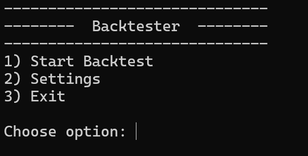
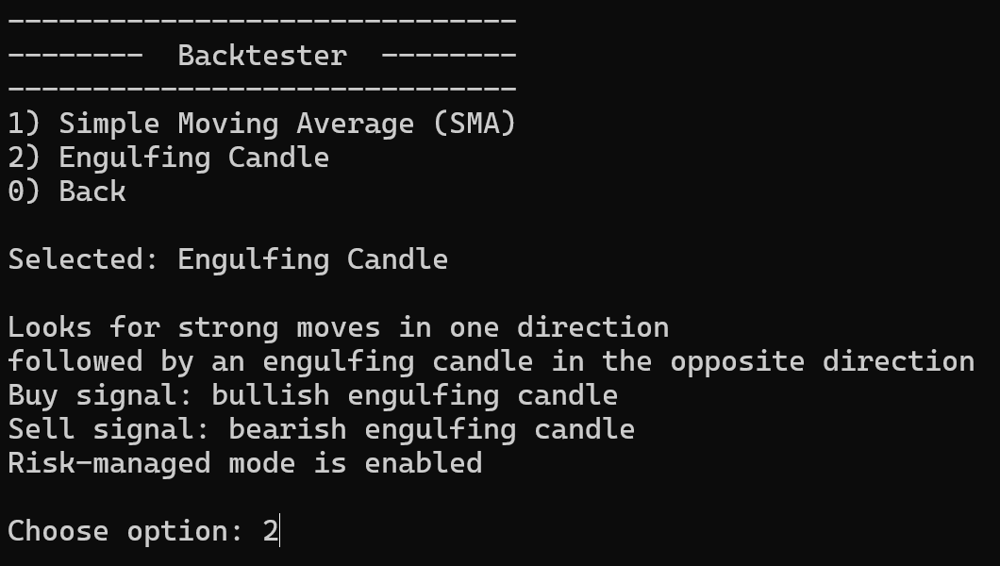
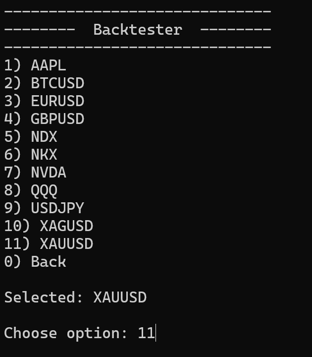
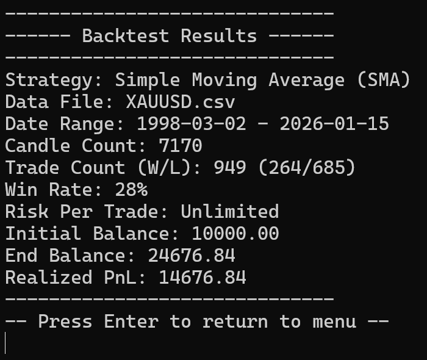

# Backtester

A C++17 CLI simulation engine for testing rule-based trading strategies against historical OHLC data. Built around a clean separation between data ingestion, strategy logic, position lifecycle, and balance accounting.

---









---

## Architecture

**Simulation loop** - `Backtester::run()` iterates candles, calls `strategy_->onCandle()` to get a signal and optional stop-loss, then passes both to `positionManager_.onCandle()`. The loop itself contains no strategy logic and no position logic.

**Strategy interface** - `onCandle(candle, stopLoss)` returns a `Signal` and optionally sets a stop-loss by reference.

**Data layer** - `DataManager` handles CSV ingestion, OHLC parsing, and data directory resolution. It has no coupling to strategy or position logic.

**Position and wallet** - `Wallet` is encapsulated inside `PositionManager`. Position lifecycle (open, close, direction, stop/target) and balance accounting are separated internally, which is reflected in the test coverage - each is tested independently via snapshots.

---

## Risk Model

Two execution modes are supported, determined per strategy:

**Price-change mode** - no stop-loss or position sizing. PnL is calculated as the percentage price change from open to close price. Used by SMA.

**Risk-managed mode** - the strategy sets a stop-loss; `PositionManager` derives the profit target from `risk / riskReward`. PnL is applied as a fixed percentage of wallet balance (`riskPerTrade`), win or loss. Used by Engulfing.

---

## Strategies

### Simple Moving Average (SMA)

14-period SMA. Long on close above SMA, short on close below. No position sizing - full balance per trade.

### Engulfing Candle

Looks for a sequence of same-direction candles followed by an engulfing candle in the opposite direction. Risk-managed sizing enabled.

---

## Build

```
cmake -S . -B build
cmake --build build
```

**Requirements**

* CMake >= 3.15
* C++17 compiler
* Terminal with ANSI escape code support

---

## Run

```
./build/backtester [<path/to/data-dir>]
```

If no path is provided, the engine tries `./data`, then `../data`. Data files must be CSV with the format `Date,Open,High,Low,Close`.

---

## Testing

Unit tests cover `DataManager`, `PositionManager`, and `Wallet` - the stateful components where bugs compound across a simulation run.

```
cmake --build build --target unit_tests
./build/unit_tests
```
